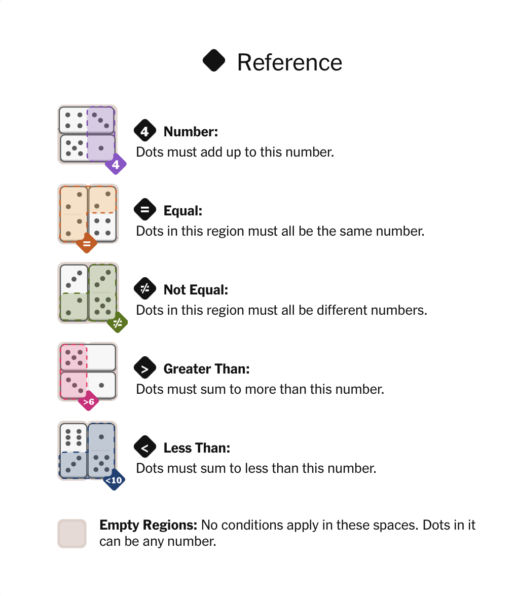

# 🧩 Pips Solver

A solver for the **Pips puzzle**, from the New York Times Games.

---

## How to Play

In **Pips**, you are given a grid and a set of dominoes.  
Your goal is to place all dominoes on the grid such that **every constraint is satisfied**.

- Each domino covers two adjacent cells
- Some cells are part of a constraint group
- All group constraints must be satisfied simultaneously

---



---

## Puzzle Format
```text
Grid:
3x5
. 0 0 . .
* 1 2 . 3
1 1 2 . *

Requirements:
0: 7
1: =
2: =
3: >4

Dominoes:
|3|4|
|3|0|
|1|6|
|3|5|
|0|2|
```
- The * represents a cell with no constraints
- Numbers are constraint groups
- A . is a blocked cell (no placement allowed)

---

## ▶️ Usage

Run your solver like this:

```bash
./pips puzzles/puzzle1.txt all
```

where "all" indicates all solutions, and "one" indicates only one solution.